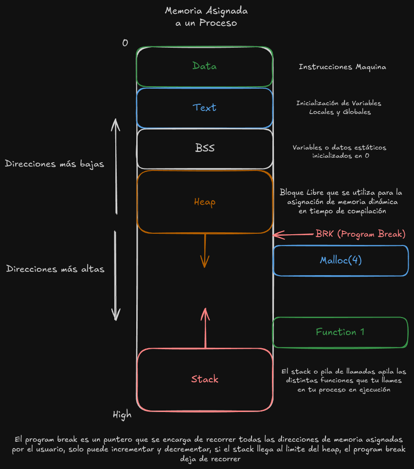

# Memory Allocator en C++

## Descripción
Este proyecto implementa un *memory allocator* personalizado en C++ para gestionar la asignación y liberación de memoria de manera eficiente. Es útil en aplicaciones donde se requiere un control más fino sobre el uso de la memoria que el proporcionado por los operadores estándar `new` y `delete`.



## Características
- Gestión personalizada de bloques de memoria.
- Reducción de fragmentación de memoria.
- Soporte para asignación dinámica y liberación de memoria.
- Interfaz intuitiva para integrarse en proyectos existentes.

## Requisitos
- **C++17 o superior**
- Un compilador compatible con C++ (GCC, Clang, MSVC, G++, etc.)

## Estructura del Proyecto
```
project-root/
├── src/
│   ├── memoryBlock.h  // Estructuras de datos
│   ├── utils.cpp      // Algoritmos de optimización
│   ├── malloc.cpp     // Funciones principales
│   └── main.cpp       // Ejemplo de uso
├── tests/
│   └── tests.cpp      // Pruebas unitarias
├── .gitignore         // Para ignorar archivos en git
└── README.md          // Este archivo
```

## Instalación y Ejecución

### Clonación del Repositorio
```bash
git clone https://github.com/tu-usuario/memory-allocator.git
cd memory-allocator
```

### Compilación y Ejecución
```bash
g++ src/main.cpp -o bin/MemoryAllocator

./bin/MemoryAllocator
```

## Implementación
El *memory allocator* utiliza una estructura basada en listas enlazadas para gestionar los bloques de memoria. Cada bloque contiene metadatos sobre su tamaño y estado (libre o ocupado). El diseño minimiza la fragmentación y maximiza la reutilización de la memoria.

### API Principal
- **`void* malloc(size_t size)`**: Asigna un bloque de memoria del tamaño solicitado. Si no hay espacio suficiente en la lista actual, solicita más memoria al sistema operativo.
- **`void free(void* ptr)`**: Libera un bloque de memoria previamente asignado, marcándolo como libre y fusionando bloques contiguos libres si es posible.
- **`void* realloc(void* ptr, size_t size)`**: Redimensiona un bloque de memoria existente. Si el tamaño solicitado es mayor, se asigna un nuevo bloque y se copian los datos existentes.
- **`void* calloc(size_t num, size_t size)`**: Asigna memoria para un arreglo de `num` elementos, inicializándolos a cero.

## Pruebas
Se incluyen pruebas unitarias en el archivo `tests.cpp` que validan las funcionalidades principales del allocator. Para ejecutarlas:

```bash
g++ tests/tests.cpp -o bin/MemoryAllocatorTests

./bin/MemoryAllocatorTests
```

## Links de información

**[Writing a memory allocator by dmitry soshnikov](http://dmitrysoshnikov.com/compilers/writing-a-memory-allocator/)**
**[Write a simple memory allocator](https://arjunsreedharan.org/post/148675821737/memory-allocators-101-write-a-simple-memory)**
